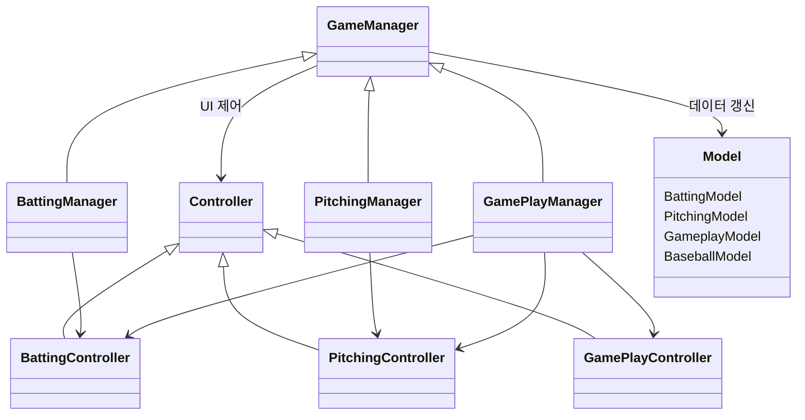

# 아키텍처
프로젝트의 구조를 도식화했습니다.

---
## 상속관계


중첩되는 코드들은 상속 관계로 개선시켰다. 코드 간의 의존성 관계가 애매하게 있어서 MVC 구조를 활용했습니다.
다만 특이하게 여기서는 Controller를 View처럼 UI를 관리하는 역할이고 기존의 MVC구조의 Controller 역할을 Manager가 합니다.

## 시퀸스 다이어그램
 ```mermaid
  sequenceDiagram
      autonumber
      participant P as 투수
      participant B as Baseball
      participant M as GamePlayManager
      participant F as 타자 · 주자 · 수비
      participant U as UI · 전광판

      P->>B: 투구 ▸ State = Pitched

      alt 배트에 맞음
          B->>M: runSignalEvent ▸ RunRunner
          M->>F: 주자 출발 ▸ IsMove = true
          alt 홈런
              B->>M: homerunEvent ▸ Homerun
              M->>M: 득점 + 주자 정리 + 다음 타자
          else 파울
              B->>M: foulEvent ▸ Foul
              M->>M: 직전 상태 롤백 + 스트라이크 1
          else 인플레이 - 히트
              M->>F: 최근접 수비수 트래킹 ▸ 포구 ▸ 송구
              alt 포스아웃 · 플라잉아웃
                  F->>M: outRunnerEvent · flyingOutEvent
                  M->>M: 주자 제거 + 아웃 1
              else 세이프
                  M->>F: 주자 베이스 안착
              end
          end
      else 배트에 안 맞음 ▸ PitchResult
          alt 헛스윙 · 루킹 스트라이크
              B->>M: strikeEvent ▸ Strike++
              opt 3 스트라이크
                  M->>M: 삼진 아웃 + 아웃 1
              end
          else 존 밖
              B->>M: addBallCountEvent ▸ BallCount++
              opt 4 볼
                  M->>M: 볼넷 ▸ 주자 한 칸 진루
              end
          end
      end

      M->>U: 카운트 · 아웃 · 점수 갱신
      B->>M: State = Dead ▸ backToPitcherEvent ▸ PitcherGetBall
      M->>M: 공 리셋 + 다음 타석 · 3아웃이면 이닝 교대
  ```


함수 호출이 복잡해짐에 따라 변수의 상태 변화를 추적하는 데 어려움이 있었습니다. 이를 해결하기 위해 GamePlayManager를 중심으로 시퀸스 다이어그램을 작성하여 로직을 시각화 했습니다. 덕분에 특정 함수가 실행될 때 변수가 어떤 값으로 제어되는지 직관적으로 확인하며 로직의 논리적 결함을 예방할 수 있었습니다.

### AI 투수가 공을 받은 함수


### 투수가 공을 던지는 함수

